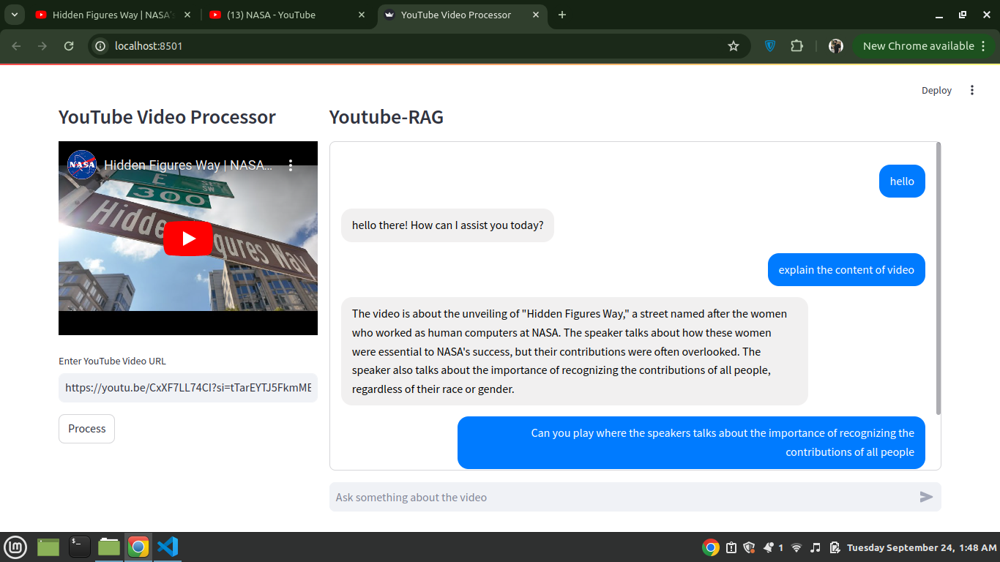

# Youtube-Rag-System

---MAKE SURE TO USE YOUR API KEY IN CONFIG FILE BEFORE USING IT--

I’ve developed a Streamlit app that processes YouTube videos and leverages ChromaDB for fast, efficient video transcription storage and search. Here's what it can do:

🔍 Key Features:

Video Transcription & Navigation: Paste any YouTube URL, get transcription, and jump directly to key moments.

ChromaDB-Powered Search: Efficiently store and retrieve video transcriptions with fast, AI-driven search.

Smart Chatbot: Ask questions about the video, and an AI chatbot (powered by Google Generative AI) guides you to specific timestamps.

🎯 Built with Langchain, Streamlit, and ChromaDB, this app makes exploring video content easier than ever!

Unfortunately, due to some compatibility issues with Streamlit, I couldn’t deploy this project yet. I’m excited to keep enhancing it—let me know what you think! 🤖💡

#AI #MachineLearning #ChromaDB #Langchain #Streamlit #YouTubeNavigator #VideoTranscription #TechInnovation
